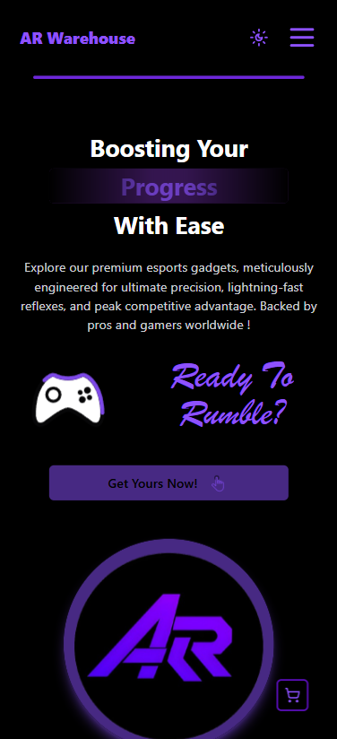
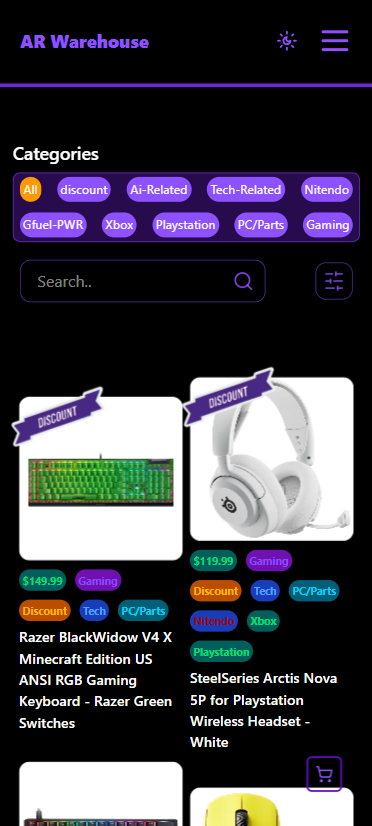
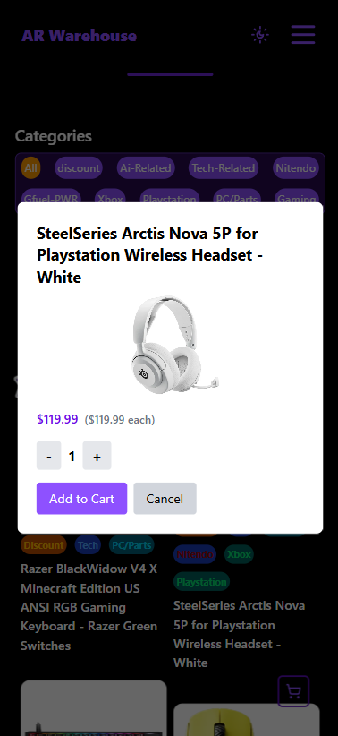
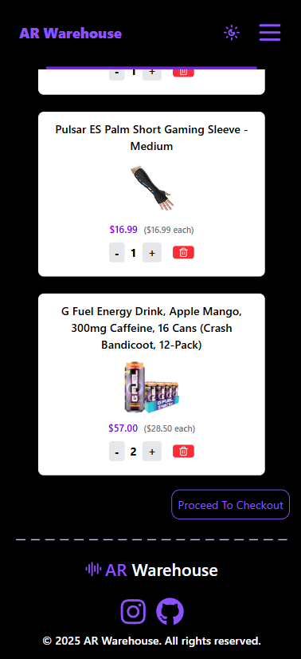
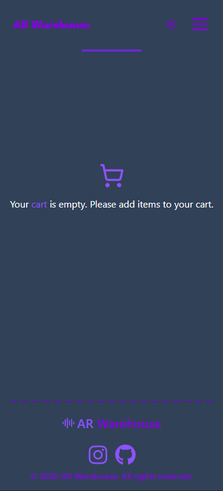
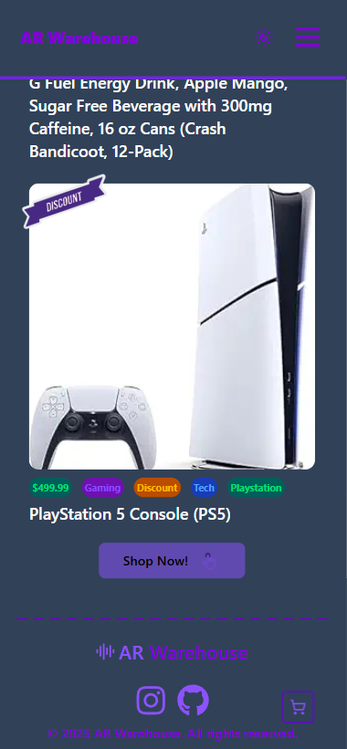

# AR Warehouse 🕹️

[](https://react.dev/)
[](https://www.typescriptlang.org/)
[](https://tailwindcss.com/)
[](LICENSE)

A modern, responsive e-commerce web app for esports gadgets, built with **React**, **TypeScript**, and **Tailwind CSS**.

---

## 🚀 Features

- **Product Catalog:** Browse a curated list of gaming and tech products.
- **Search & Filter:** Instantly search and filter products by category (Tech, Gaming, Console, etc).
- **Cart System:** Add, view, and remove items from your cart. Cart resets on reload (no backend).
- **Responsive UI:** Mobile-friendly, clean design using Tailwind CSS.
- **Animated UI:** Engaging Lottie animations and smooth transitions.
- **Dark/Light Mode:** Toggle between dark and light themes.
- **Routing:** Multi-page navigation with React Router.
- **Component-Based:** Modular, reusable React components.

---

## 📸 Screenshots









---

## 🛠️ Tech Stack

- **Frontend:** React, TypeScript
- **Styling:** Tailwind CSS
- **Routing:** React Router
- **Animation:** Lottie-react
- **Icons:** Lucide Icons

---

## 🏁 Getting Started

1. **Clone the repo**
   ```bash
   git clone https://github.com/yourusername/ar-warehouse.git
   cd ar-warehouse
   ```

2. **Install dependencies**
   ```bash
   npm install
   ```

3. **Start the development server**
   ```bash
   npm run dev
   ```

4. **Open in your browser**
   ```
   http://localhost:5173
   ```

---

## 📂 Project Structure

```
src/
  assets/           # Images, Lottie files, etc.
  cardComponents/   # Product and cart card components
  components/       # Navbar, Home, About, etc.
  data/             # Product data
  HrComponents/     # FilterBar, CartComponent, etc.
  pages/            # MainPage, ShopPage, CartPage, etc.
  types/            # TypeScript types
  App.tsx           # Main app entry
```

---

## ✨ Customization

- **Add Products:** Edit `src/data/ProductsBase.ts` to add or update products.
- **Categories:** Update `src/HrComponents/FilterBar.tsx` for new categories.
- **Styling:** Tweak Tailwind classes in components for your own look.

---

## 🤝 Contributing

Pull requests are welcome! For major changes, please open an issue first to discuss what you would like to change.

---

## 📄 License

[MIT](LICENSE)

---

## 🙏 Credits

- [React](https://react.dev/)
- [Tailwind CSS](https://tailwindcss.com/)
- [Lottie-react](https://lottiefiles.com/)
- [Lucide Icons](https://lucide.dev/)

---

> Made with ❤️ for esports fans!
